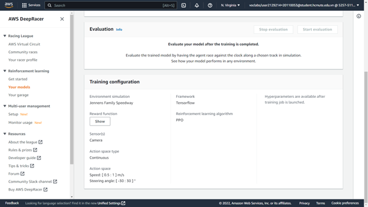

# Chương 2. Xây dựng mô hình.

## 2.1/Điều chỉnh mô hình ( cấu hình các chức năng xe đua)?
Điều chỉnh mô mình xe đua ở trong Your Garage. Nó cho phép bạn tạo và tùy chỉnh những chiếc xe ảo của riêng mình mà sau đó bạn sẽ sử dụng để đào tạo các mô hình. 
Theo mặc định, thì nó chứa một xe ảo được đặt tên là  The Original DeepRacer. Xe ban đầu sử dụng một máy ảnh mặt trước, mạng nơ-ron phức hợp 3 lớp. 
Để tùy chỉnh cấu hình xe ảo mới thì chọn vào Build new vehicle

Bắt đầu với đặt tên cho xe ảo mà ta chuẩn bị tạo ra nó. 

Tiếp theo đó ta xe chọn ngoại hình cho xe bằng cách đổ màu cho xe nếu sử dụng Vehical model mặc định.

Sau khi hoàn thành thì chọn next để qua bước tiếp theo.
Cấu hình cảm biến camera cho xe đua.
+ Nếu xe dùng để đua trên đường đua time-trial, thì nên sử dụng camera đơn. Để đua quanh một đường đua mà không có xe hoặc chướng ngại vật khác, chúng ta không cần phải cấu hình phức tạp cho xe và giúp giảm thời gian đào tạo vì càng phức tạp thì thời gian đào tạo càng lâu.
+ Nên sử dụng cảm biến camera âm thanh nổi khi xây dựng mô hình tránh vật thể hoặc mô hình đua xe head-to-head. Chùng ta sẽ sử dụng chức năng phần thưởng theo cách để mô hình học được các đặc điểm chiều sâu từ hình ảnh của ta. Lưu ý rằng trong các mô hình xe head-to-head., camera âm thanh nổi có thể không đủ để che các điểm mù. 
+ Cảm biến LIDAR hướng về phía sau có chức năng quét cách xe khoảng 0,5m. Nó sẽ phát hiện những chiếc xe đang tiến đến từ phía sau hoặc trong những điểm mù khi rẽ. Nên sử dụng nó nếu muốn tham gia vào các cuộc đua head-to-head. 

Tiếp đến chọn Done thì ta sẻ tạo ra được mô hình xe ảo theo ý muốn mà ta đã tùy chỉnh.

## 2.2/Cấu hình model 
Chọn Your garage để tiến hành các bước cấu hình cho model.

 Chọn Create Model để tiến hành tạo Model đào tạo mới.

Bắt đầu thực hiện cấu hình cho việc đào tạo.

 Đặt tên và thêm mô tả cho mô hình.

 Chọn địa hình đào tạo để tiến hành đạo tạo cho mô hình

Sau khi chọn địa hình đào tạo cho Model thì ta sẻ chọn next để qua bước cấu hình tiếp theo.

Ở bước tiếp theo ta sẻ cấu hình về các loại cuộc đua, các giải thuật và siêu tham số đưa vào cho việc đào tạo Model. 
Giới thiệu về các loại cuộc đua (Race type)
-	Time trial: Chạy đua với đồng hồ trên một đường đua được đánh dấu rõ ràng màkhông có chướng ngại vật cố định hoặc đối thủ cạnh tranh đang di chuyển.

-	Object avoidance: Xe chạy trên đường hai làn với một số chướng ngại vật cố định được đặt dọc theo đường.

-	Head-to-Head: Xe chạy đua với các phương tiện đang di chuyển khác trên đường
dành cho hai làn đường.

Chọn Object avoidance để tiến hành đào tạo.

Thuật toán đào tạo và siêu tham số

+  PPO: Thuật toán tối ưu hóa với policy gần.
+ SAC: Thuật toán tối ưu với policy ngẫu nhiên
So sánh giữa hai thuật toán huấn luyện:
Proximal Policy Optimization	Soft Actor Critic
Hoạt động trong cả không gian hành động rời rạc và liên tục.	Hoạt động trong không gian hành
động liên tục.
Học từ những lần thử bây giờ	Học từ những quan lỗi của mô hình trước.
Sử dụng regularization.	hêm entropy vào mục tiêu tối đa.

Ổn định (dữ liệu liên tục) so với Đói dữ liệu (dữ liệu rời rạc): Thông tin học được bởi các chính sách của thuật toán PPO và SAC trong khi khám phá một môi trường được sử dụng theo cách khác nhau. PPO sử dụng phương pháp học tập theo chính sách có nghĩa là nó học được chức năng giá trị của mình từ những quan sát được thực hiện bởi chính sách hiện tại khám phá môi trường. SAC sử dụng phương pháp học tập ngoài chính sách có nghĩa là nó có thể sử dụng các quan sát được thực hiện bởi quá trình thăm dò môi trường của các chính sách trước đó. Sự cân bằng giữa việc học tập chính sách và học tập đúng chính sách thường là tính ổn định so với hiệu quả dữ liệu. Các thuật toán đúng chính sách có xu hướng ổn định hơn nhưng đói dữ liệu, trong khi các thuật toán ngoài chính sách có xu hướng ngược lại.
Khám phá so với Khai thác: Khám phá và khai thác là một thách thức quan trọng trong RL. Một thuật toán nên khai thác thông tin đã biết từ những trải nghiệm trước đó để đạt được phần thưởng tích lũy cao hơn, nhưng nó cũng cần khám phá để có được những trải nghiệm mới có thể được sử dụng để tìm ra chính sách tối ưu trong tương lai. Khi một chính sách được đào tạo qua nhiều lần lặp lại và tìm hiểu thêm về môi trường, chính sách đó trở nên chắc chắn hơn về việc lựa chọn hành động cho một quan sát nhất định. Tuy nhiên, nếu chính sách không đủ khám phá, nó có thể sẽ bám vào thông tin đã được học ngay cả khi nó không ở mức tối ưu. Thuật toán PPO khuyến khích thăm dò bằng cách sử dụng chính quy hóa entropy, điều này ngăn cản các tác nhân hội tụ đến optima cục bộ. Thuật toán SAC đạt được sự cân bằng đặc biệt giữa thăm dò và khai thác bằng cách thêm entropy vào mục tiêu tối đa hóa của nó.
Sự hỗn loạn:
 + Trong ngữ cảnh này, 'entropy' là thước đo độ không chắc chắn trong chính sách, vì vậy nó có thể được hiểu là thước đo mức độ tin cậy của một chính sách khi lựa chọn hành động cho một trạng thái nhất định. Chính sách có entropy thấp rất tự tin trong việc lựa chọn hành động, trong khi chính sách có entropy cao không chắc chắn về việc chọn hành động nào.
 + Chiến lược tối đa hóa entropy của thuật toán SAC có những lợi thế tương tự như việc sử dụng entropy của thuật toán PPO làm bộ điều chỉnh. Giống như PPO, nó khuyến khích khám phá rộng hơn và tránh sự hội tụ đến một điểm tối ưu cục bộ xấu bằng cách khuyến khích tác nhân chọn một hành động có entropy cao hơn. Không giống như điều hòa entropy, tối đa hóa entropy có một lợi thế duy nhất. Nó có xu hướng từ bỏ các chính sách chọn hành vi không thỏa hiệp, đó là một lý do khác khiến thuật toán SAC có xu hướng tiết kiệm dữ liệu hơn PPO.
 + Điều chỉnh lượng entropy trong SAC bằng cách sử dụng siêu thông số SAC alpha. Giá trị entropy SAC alpha tối đa (1,0) cho phép thăm dò. Giá trị tối thiểu (0,0) khôi phục mục tiêu RL tiêu chuẩn và vô hiệu hóa phần thưởng
entropy khuyến khích thăm dò. Giá trị alpha SAC tốt để bắt đầu thử nghiệm là 0,5. Điều chỉnh phù hợp khi bạn lặp lại trên các mô hình của mình.
	Hãy thử cả thuật toán PPO và SAC, thử nghiệm với siêu tham số của chúng và khám phá chúng với mỗi lần huấn luyện mô hình.
+ Proximal Policy Optimization: Thuật toán độ dốc chính sách tiên tiến nhất sử dụng hai mạng thần kinh trong quá trình đào tạo – mạng chính sách và mạng giá trị.

## 2.3/Một số thuật toán  traiing  đã cải tiến ?

## 2.4/Cách đánh giá hiệu suất model ?

## 2.5/Các yếu tố ảnh hưởng  đến hiệu suất model ?

## 2.6/Quy trình xây dựng  model ?
Để đánh giá một mô hình được đào tạo trong bảng điều khiển AWS DeepRacer
### B1/ Từ ngăn điều hướng chính, chọn   Your Model rồi chọn mô hình bạn vừa đào tạo từ danh sách Mô hình để mở trang chi tiết mô hình.
### B2/ Chọn Evaluation tab
### B3/  Evaluation details ->   Start evaluation

Bạn có thể bắt đầu đánh giá sau khi trạng thái công việc đào tạo của bạn thay đổi thành Completed   hoặc trạng thái của mô hình thay đổi thành  Ready nếu công việc đào tạo chưa hoàn thành.
Một mô hình đã sẵn sàng khi công việc đào tạo hoàn tất. Nếu quá trình đào tạo chưa hoàn thành, mô hình cũng có thể ở trạng thái Sẵn sàng nếu nó được đào tạo đến điểm không thành công.
### B4/ Trên trang Evaluate model , bên dưới Evaluate criteria , nhập tên cho đánh giá của bạn, sau đó chọn loại cuộc đua mà bạn đã chọn để đào tạo mô hình.

Để đánh giá, bạn có thể chọn loại đường đua khác với loại đường đua được sử dụng trong huấn luyện. Ví dụ: bạn có thể đào tạo một mô hình cho các cuộc đua đối đầu với bot và sau đó đánh giá mô hình đó để thử nghiệm theo thời gian. Nói chung, mô hình phải khái quát hóa tốt nếu loại cuộc đua đào tạo khác với loại cuộc đua đánh giá. Đối với lần chạy đầu tiên, bạn nên sử dụng cùng một loại cuộc đua để đánh giá và huấn luyện.
Bạn có thể chọn bất kỳ đường chạy nào để đánh giá mô hình của mình, tuy nhiên, bạn có thể mong đợi hiệu suất tốt nhất trên đường chạy gần giống nhất với đường chạy được sử dụng trong đào tạo.
Để xem mô hình của bạn có khái quát hóa tốt hay không, hãy chọn một bản đánh giá khác với bản được sử dụng trong đào tạo.

### B5/ Trên trang Evaluate model, bên dưới  Virtual Race Submission, đối với mô hình đầu tiên của bạn, hãy tắt tùy chọn Submit model after evaluation. Sau này, nếu bạn muốn tham gia một sự kiện đua xe, hãy bật tùy chọn này.

###  B6/ Trên trang Evaluate model , chọn  Start evaluation để bắt đầu tạo và khởi tạo công việc đánh giá.
Quá trình khởi tạo này mất khoảng 3 phút để hoàn thành.

### B7/Khi quá trình đánh giá diễn ra, kết quả đánh giá, bao gồm thời gian dùng thử và tỷ lệ hoàn thành đường đua, được hiển thị dưới phần chi tiết đánh giá sau mỗi lần thử. Trong cửa sổ Simulation video stream , bạn có thể xem tác nhân thực hiện như thế nào trên đường đã chọn.

Bạn có thể dừng một công việc đánh giá trước khi nó hoàn thành. Để dừng công việc đánh giá, hãy chọn Stop evaluation ở góc trên bên phải của  Evaluation rồi xác nhận để dừng đánh giá.

 ### B8/  Sau khi công việc đánh giá hoàn tất, hãy kiểm tra chỉ số hiệu suất của tất cả các thử nghiệm trong Evaluation results. . Luồng video mô phỏng đi kèm không còn nữa.
 
 Lịch sử đánh giá mô hình của bạn có sẵn trong  Evaluation selector . Để xem chi tiết của một đánh giá cụ thể, hãy chọn đánh giá từ Evaluation selector , sau đó chọn Load evaluation  từ góc trên cùng bên phải của Evaluation selector .
 Đối với công việc đánh giá cụ thể này, mô hình được đào tạo sẽ hoàn thành các thử nghiệm với một hình phạt đáng kể về thời gian không theo dõi. Lần chạy đầu tiên, điều này không có gì lạ. Các lý do có thể bao gồm việc đào tạo không hội tụ và đào tạo cần nhiều thời gian hơn, không gian hành động cần được mở rộng để cung cấp cho nhân viên nhiều chỗ hơn để phản ứng hoặc chức năng phần thưởng cần được cập nhật để xử lý các môi trường khác nhau.
Bạn có thể tiếp tục cải thiện mô hình bằng cách sao chép mô hình đã được đào tạo trước đó, sửa đổi chức năng phần thưởng, điều chỉnh siêu tham số, sau đó lặp lại quy trình cho đến khi tổng phần thưởng hội tụ và chỉ số hiệu suất được cải thiện. Để biết thêm thông tin về cách cải thiện quá trình đào tạo, hãy xem Đào tạo và đánh giá các mô hình AWS DeepRacer.
Để chuyển mô hình được đào tạo hoàn chỉnh của bạn sang phương tiện AWS DeepRacer để lái trong môi trường thực tế, bạn cần tải xuống các thành phần lạ của mô hình. Để làm như vậy, hãy chọn Tải xuống mô hình trên trang chi tiết của mô hình. Nếu phương tiện vật lý AWS DeepRacer của bạn không hỗ trợ cảm biến mới và mô hình của bạn đã được huấn luyện với các loại cảm biến mới, thì bạn sẽ nhận được thông báo lỗi khi sử dụng mô hình trên phương tiện AWS DeepRacer của mình trong môi trường thế giới thực. Để biết thêm thông tin về thử nghiệm mô hình AWS DeepRacer với tác nhân vật lý, xem Vận hành phương tiện AWS DeepRacer của bạn.