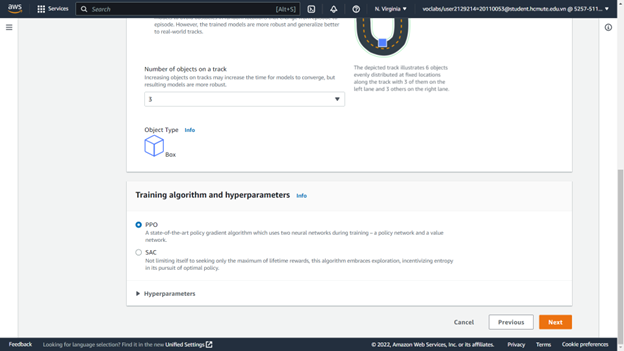

# Chương 2. Xây dựng mô hình.

## 2.1/Điều chỉnh mô hình ( cấu hình các chức năng xe đua)?
Điều chỉnh mô mình xe đua ở trong Your Garage. Nó cho phép bạn tạo và tùy chỉnh những chiếc xe ảo của riêng mình mà sau đó bạn sẽ sử dụng để đào tạo các mô hình. 
Theo mặc định, thì nó chứa một xe ảo được đặt tên là  The Original DeepRacer. Xe ban đầu sử dụng một máy ảnh mặt trước, mạng nơ-ron phức hợp 3 lớp. 
Để tùy chỉnh cấu hình xe ảo mới thì chọn vào Build new vehicle

Bắt đầu với đặt tên cho xe ảo mà ta chuẩn bị tạo ra nó. 

Tiếp theo đó ta xe chọn ngoại hình cho xe bằng cách đổ màu cho xe nếu sử dụng Vehical model mặc định.

Sau khi hoàn thành thì chọn next để qua bước tiếp theo.
Cấu hình cảm biến camera cho xe đua.
+ Nếu xe dùng để đua trên đường đua time-trial, thì nên sử dụng camera đơn. Để đua quanh một đường đua mà không có xe hoặc chướng ngại vật khác, chúng ta không cần phải cấu hình phức tạp cho xe và giúp giảm thời gian đào tạo vì càng phức tạp thì thời gian đào tạo càng lâu.
+ Nên sử dụng cảm biến camera âm thanh nổi khi xây dựng mô hình tránh vật thể hoặc mô hình đua xe head-to-head. Chùng ta sẽ sử dụng chức năng phần thưởng theo cách để mô hình học được các đặc điểm chiều sâu từ hình ảnh của ta. Lưu ý rằng trong các mô hình xe head-to-head., camera âm thanh nổi có thể không đủ để che các điểm mù. 
+ Cảm biến LIDAR hướng về phía sau có chức năng quét cách xe khoảng 0,5m. Nó sẽ phát hiện những chiếc xe đang tiến đến từ phía sau hoặc trong những điểm mù khi rẽ. Nên sử dụng nó nếu muốn tham gia vào các cuộc đua head-to-head. 

Tiếp đến chọn Done thì ta sẻ tạo ra được mô hình xe ảo theo ý muốn mà ta đã tùy chỉnh.

## 2.2/Cấu hình model 

Chọn Your garage để tiến hành các bước cấu hình cho model.

 Chọn Create Model để tiến hành tạo Model đào tạo mới.

Bắt đầu thực hiện cấu hình cho việc đào tạo.

 Đặt tên và thêm mô tả cho mô hình.

 Chọn địa hình đào tạo để tiến hành đạo tạo cho mô hình

Sau khi chọn địa hình đào tạo cho Model thì ta sẻ chọn next để qua bước cấu hình tiếp theo.

Ở bước tiếp theo ta sẻ cấu hình về các loại cuộc đua, các giải thuật và siêu tham số đưa vào cho việc đào tạo Model. 
Giới thiệu về các loại cuộc đua (Race type)
-	Time trial: Chạy đua với đồng hồ trên một đường đua được đánh dấu rõ ràng màkhông có chướng ngại vật cố định hoặc đối thủ cạnh tranh đang di chuyển.

-	Object avoidance: Xe chạy trên đường hai làn với một số chướng ngại vật cố định được đặt dọc theo đường.

-	Head-to-Head: Xe chạy đua với các phương tiện đang di chuyển khác trên đường dành cho hai làn đường.

Chọn Object avoidance để tiến hành đào tạo.

Thuật toán đào tạo và siêu tham số

+ PPO: Thuật toán tối ưu hóa với policy gần.
+ SAC: Thuật toán tối ưu với policy ngẫu nhiên

So sánh giữa hai thuật toán huấn luyện:

-Proximal Policy Optimization:
+ Hoạt động trong cả không gian hành động rời rạc và liên tục.
+ Học từ những lần thử bây giờ.
+ Sử dụng regularization.

-Soft Actor Critic:
+ Hoạt động trong không gian hành động liên tục.
+ Học từ những quan lỗi của mô hình trước.
+ Thêm entropy vào mục tiêu tối đa.

Ổn định (dữ liệu liên tục) so với Đói dữ liệu (dữ liệu rời rạc): Thông tin học được bởi các chính sách của thuật toán PPO và SAC trong khi khám phá một môi trường được sử dụng theo cách khác nhau. PPO sử dụng phương pháp học tập theo chính sách có nghĩa là nó học được chức năng giá trị của mình từ những quan sát được thực hiện bởi chính sách hiện tại khám phá môi trường. SAC sử dụng phương pháp học tập ngoài chính sách có nghĩa là nó có thể sử dụng các quan sát được thực hiện bởi quá trình thăm dò môi trường của các chính sách trước đó. Sự cân bằng giữa việc học tập chính sách và học tập đúng chính sách thường là tính ổn định so với hiệu quả dữ liệu. Các thuật toán đúng chính sách có xu hướng ổn định hơn nhưng đói dữ liệu, trong khi các thuật toán ngoài chính sách có xu hướng ngược lại.
Khám phá so với Khai thác: Khám phá và khai thác là một thách thức quan trọng trong RL. Một thuật toán nên khai thác thông tin đã biết từ những trải nghiệm trước đó để đạt được phần thưởng tích lũy cao hơn, nhưng nó cũng cần khám phá để có được những trải nghiệm mới có thể được sử dụng để tìm ra chính sách tối ưu trong tương lai. Khi một chính sách được đào tạo qua nhiều lần lặp lại và tìm hiểu thêm về môi trường, chính sách đó trở nên chắc chắn hơn về việc lựa chọn hành động cho một quan sát nhất định. Tuy nhiên, nếu chính sách không đủ khám phá, nó có thể sẽ bám vào thông tin đã được học ngay cả khi nó không ở mức tối ưu. Thuật toán PPO khuyến khích thăm dò bằng cách sử dụng chính quy hóa entropy, điều này ngăn cản các tác nhân hội tụ đến optima cục bộ. Thuật toán SAC đạt được sự cân bằng đặc biệt giữa thăm dò và khai thác bằng cách thêm entropy vào mục tiêu tối đa hóa của nó.
Sự hỗn loạn:
+ Trong ngữ cảnh này, 'entropy' là thước đo độ không chắc chắn trong chính sách, vì vậy nó có thể được hiểu là thước đo mức độ tin cậy của một chính sách khi lựa chọn hành động cho một trạng thái nhất định. Chính sách có entropy thấp rất tự tin trong việc lựa chọn hành động, trong khi chính sách có entropy cao không chắc chắn về việc chọn hành động nào.
+ Chiến lược tối đa hóa entropy của thuật toán SAC có những lợi thế tương tự như việc sử dụng entropy của thuật toán PPO làm bộ điều chỉnh. Giống như PPO, nó khuyến khích khám phá rộng hơn và tránh sự hội tụ đến một điểm tối ưu cục bộ xấu bằng cách khuyến khích tác nhân chọn một hành động có entropy cao hơn. Không giống như điều hòa entropy, tối đa hóa entropy có một lợi thế duy nhất. Nó có xu hướng từ bỏ các chính sách chọn hành vi không thỏa hiệp, đó là một lý do khác khiến thuật toán SAC có xu hướng tiết kiệm dữ liệu hơn PPO.
+ Điều chỉnh lượng entropy trong SAC bằng cách sử dụng siêu thông số SAC alpha. Giá trị entropy SAC alpha tối đa (1,0) cho phép thăm dò. Giá trị tối thiểu (0,0) khôi phục mục tiêu RL tiêu chuẩn và vô hiệu hóa phần thưởng
entropy khuyến khích thăm dò. Giá trị alpha SAC tốt để bắt đầu thử nghiệm là 0,5. Điều chỉnh phù hợp khi bạn lặp lại trên các mô hình của mình.
Hãy thử cả thuật toán PPO và SAC, thử nghiệm với siêu tham số của chúng và khám phá chúng với mỗi lần huấn luyện mô hình.
+ Proximal Policy Optimization: Thuật toán độ dốc chính sách tiên tiến nhất sử dụng hai mạng thần kinh trong quá trình đào tạo – mạng chính sách và mạng giá trị.

Giải thích các thông số bên trong PPO.
Tham số	Định nghĩa
Gradient descent batch size	       Số lượng experience xe gần đây được lấy mẫu ngẫu nhiên từ bộ đệm trải nghiệm và được sử dụng để cập nhật trọng số mạng nơ-ron. Nếu bạn có 5120 experience trong bộ đệm và chỉ định kích thước batch là 512, sau đó bỏ qua lấy mẫu ngẫu nhiên, bạn sẽ nhận được 10 batch experience. Lần lượt, mỗi batch sẽ được sử dụng để cập nhật trọng số mạng thần kinh của bạn trong quá trình đào tạo. Sử dụng kích thước batch lớn hơn để thúc đẩy cập nhật ổn định và trơn tru hơn đối với trọng số mạng nơ-ron, nhưng lưu ý khả năng quá trình đào tạo có thể chậm hơn.
Number of epochs	       Một epoch đại diện cho một lần đi qua tất cả các batch, trong đó trọng số mạng nơ-ron được cập nhật sau mỗi batch được xử lý, trước khi tiếp tục với batch tiếp theo. 10 epochs ngụ ý rằng bạn sẽ cập nhật trọng số mạng nơ-ron, sử dụng tất cả các batch một lần, nhưng lặp lại quá trình này 10 lần. Sử dụng số lượng epoch lớn hơn để thúc đẩy các bản cập nhật ổn định hơn, nhưng mong đợi quá trình đào tạo chậm hơn. Khi kích thước batch nhỏ, bạn có thể sử dụng số lượng epoch nhỏ hơn.
Learning rate	       Tốc độ học tập kiểm soát mức độ cập nhật đối với trọng số mạng nơ-ron. Nói một cách đơn giản, khi bạn cần thay đổi trọng số của chính sách của mình để đạt được phần thưởng tích lũy tối đa, bạn nên thay đổi chính sách của mình bao nhiêu. Tỷ lệ học tập lớn hơn sẽ dẫn đến đào tạo nhanh hơn, nhưng nó có thể gặp khó khăn để hội tụ. Tỷ lệ học tập nhỏ hơn dẫn đến sự hội tụ ổn định, nhưng có thể mất nhiều thời gian để đào tạo.
Entropy	       Một mức độ không chắc chắn, hoặc ngẫu nhiên, được thêm vào phân phối xác suất của không gian hành động. Điều này giúp thúc đẩy việc lựa chọn các hành động ngẫu nhiên để khám phá trạng thái / không gian hành động một cách rộng rãi hơn.
Discount factor	       Hệ số chỉ định mức độ đóng góp của phần thưởng trong tương lai vàophần thưởng tích lũy dự kiến. Hệ số chiết khấu càng lớn thì mô hình càng xa để xác định phần thưởng tích lũy mong đợi và đào tạo càng chậm. Với hệ số chiết khấu là 0,9, chiếc xe bao gồm phần thưởng từ thứ tự 10 bước trong tương lai để thực hiện một bước di chuyển. Với hệ số chiết khấu là 0,999, chiếc xe sẽ xem xét phần thưởng từ thứ tự 1000 bước trong tương lai để thực hiện một bước đi. Các giá trị hệ số chiết khấu được đề xuất là 0,99, 0,999 và 0,9999.
Loss type	       Loại tổn thất chỉ định loại hàm mục tiêu (hàm chi phí) được sử dụng để cập nhật trọng số mạng. Các loại lỗi mất bình phương Huber và Trung bình hoạt động tương tự đối với các bản cập nhật nhỏ. Nhưng khi các bản cập nhật trở nên lớn hơn, tổn thất Huber có gia số nhỏ hơn so với tổn thất lỗi trung bình bình phương. Khi bạn gặp vấn đề về hội tụ, hãy sử dụng kiểu mất Huber. Khi độ hội tụ tốt và bạn muốn đào tạo nhanh hơn, hãy sử dụng kiểu mất lỗi bình phương trung bình.
Number of experience episodes between each policy-updating iteration	     Thông số này kiểm soát lượng trải nghiệm mà chiếc xe sẽ có được giữa mỗi lần lặp lại đào tạo mô hình. Đối với các vấn đề phức tạp hơn có nhiều cực đại cục bộ hơn, bộ đệm trải nghiệm lớn hơn là cần thiết để cung cấp nhiều điểm dữ liệu không tương quan hơn. Trong trường hợp này, việc đào tạo sẽ chậm hơn nhưng ổn định hơn. Các giá trị được đề xuất là 10, 20 và 40.

+ Soft Actor Critic: Không giới hạn bản thân trong việc chỉ tìm kiếm phần thưởng tối đa trọn đời, thuật toán này bao gồm việc khám phá, khuyến khích entropy theo đuổi chính sách tối ưu.

Giải thích các thông số bên trong SAC.
Tham số	Định nghĩa
Gradient descent batch size	       Số lượng experience xe gần đây được lấy mẫu ngẫu nhiên từ bộ đệm trải nghiệm và được sử dụng để cập nhật trọng số mạng nơ-ron. Nếu bạn có 5120 experience trong bộ đệm và chỉ định kích thước batch là 512, sau đó bỏ qua lấy mẫu ngẫu nhiên, bạn sẽ nhận được 10 batch experience. Lần lượt, mỗi batch sẽ được sử dụng để cập nhật trọng số mạng thần kinh của bạn trong quá trình đào tạo. Sử dụng kích thước batch lớn hơn để thúc đẩy cập nhật ổn định và trơn tru hơn đối với trọng số mạng nơ-ron, nhưng lưu ý khả năng quá trình đào tạo có thể chậm hơn.
Learning rate	       Tốc độ học tập kiểm soát mức độ cập nhật đối với trọng số mạng nơ-ron. Nói một cách đơn giản, khi bạn cần thay đổi trọng số của chính sách của mình để đạt được phần thưởng tích lũy tối đa, bạn nên thay đổi chính sách của mình bao nhiêu. Tỷ lệ học tập lớn hơn sẽ dẫn đến đào tạo nhanh hơn, nhưng nó có thể gặp khó khăn để hội tụ. Tỷ lệ học tập nhỏ hơn dẫn đến sự hội tụ ổn định, nhưng có thể mất nhiều thời gian để đào tạo.
SAC alpha (α) value	      Giá trị số thực giữa 0 và 1. Giá trị tối thiểu (0,0) phục hồi mục tiêu RL tiêu chuẩn và trung hòa phần thưởng entropy khuyến khích khám phá. Giá trị SAC alpha tốt để bắt đầu thử nghiệm là 0,5. Điều chỉnh cho phù hợp khi bạn lặp lại các mô hình của mình.
Discount factor	       Hệ số chỉ định mức độ đóng góp của phần thưởng trong tương lai vàophần thưởng tích lũy dự kiến. Hệ số chiết khấu càng lớn thì mô hình càng xa để xác định phần thưởng tích lũy mong đợi và đào tạo càng chậm. Với hệ số chiết khấu là 0,9, chiếc xe bao gồm phần thưởng từ thứ tự 10 bước trong tương lai để thực hiện một bước di chuyển. Với hệ số chiết khấu là 0,999, chiếc xe sẽ xem xét phần thưởng từ thứ tự 1000 bước trong tương lai để thực hiện một bước đi. Các giá trị hệ số chiết khấu được đề xuất là 0,99, 0,999 và 0,9999.
Loss type	       Loại tổn thất chỉ định loại hàm mục tiêu (hàm chi phí) được sử dụng để cập nhật trọng số mạng. Các loại lỗi mất bình phương Huber và Trung bình hoạt động tương tự đối với các bản cập nhật nhỏ. Nhưng khi các bản cập nhật trở nên lớn hơn, tổn thất Huber có gia số nhỏ hơn so với tổn thất lỗi trung bình bình phương. Khi bạn gặp vấn đề về hội tụ, hãy sử dụng kiểu mất Huber. Khi độ hội tụ tốt và bạn muốn đào tạo nhanh hơn, hãy sử dụng kiểu mất lỗi bình phương trung bình.
Number of experience episodes between each policy-updating iteration	     Thông số này kiểm soát lượng trải nghiệm mà chiếc xe sẽ có được giữa mỗi lần lặp lại đào tạo mô hình. Đối với các vấn đề phức tạp hơn có nhiều cực đại cục bộ hơn, bộ đệm trải nghiệm lớn hơn là cần thiết để cung cấp nhiều điểm dữ liệu không tương quan hơn. Trong trường hợp này, việc đào tạo sẽ chậm hơn nhưng ổn định hơn. Các giá trị duy nhất 1

-	Chọn PPO với các thông số mặc định.
Chọn Next để tiến hành qua bước tiếp theo cho việc cấu hình Model đào tạo.

Xác định không gian hành động
Tại sao không gian hành động lại quan trọng?
+ Trong học tăng cường, tập hợp tất cả các hành động hoặc lựa chọn hợp lệ có sẵn cho một tác nhân khi nó tương tác với môi trường được gọi là không gian hành động. Trong bảng điều khiển AWS DeepRacer, bạn có thể đào tạo tổng đài viên trong không gian hành động rời rạc hoặc liên tục.
+ Khi đào tạo một mô hình AWS DeepRacer, không gian hành động xác định các tổ hợp tốc độ và góc lái có sẵn cho tác nhân. Một hành động là sự kết hợp tốc độ và góc lái đơn lẻ hoặc sự lựa chọn mà một tác nhân có thể thực hiện.
Chọn không gian hành động:
+ Không gian liên tục: Không gian hành động liên tục cho phép tác nhân chọn một
hành động từ một loạt các giá trị cho mỗi trạng thái. (Continuous action space)

Steering angle (Góc lái): Góc lái xác định phạm vi góc lái mà bánh trước của mô
hình của bạn có thể quay.
Speed (Tốc độ): Tốc độ mà mô hình có thể đạt được. Tốc độ tối đa/tối thiểu được
xác định sẵn cho mô hình.
+ Không gian hành động rời rạc đại diện cho tất cả các hành động có thể có của
tác nhân đối với mỗi trạng thái trong một tập hợp hữu hạn. (Discrete action space)

Steering angle (Góc lái): Góc lái xác định phạm vi góc lái mà bánh trước của mô hình của bạn có thể quay.
Speed (Tốc độ): Tốc độ mà mô hình có thể đạt được. Tốc độ tối đa/tối thiểu được xác định sẵn cho mô hình.
	Chọn theo Continuous action space theo các thông số mặc định.

Ta tiến hành chọn Next để tiếp tục cấu hình ở bước tiếp theo.

Chọn mô hình xe ảo để đào tạo.
Có thể chọn mô hình tùy theo ý thích, với hình dưới bên trái là mô hình mình tự tạo, bên phải là mô hình đã được tạo sẵn.

Thuật toán thưởng.
-	Thuật toán thưởng (Reward Function): model chúng ta có thể thay đổi Reward
function để giúp model trở lên tốt hơn. Sau đó nhấn Validate để đánh giá thuật toán.
-	Thuật toán thưởng cơ bản (Basic Reward Function): trước tiên chúng ta tạo ba dải
xung quanh đường đua, sử dụng ba điểm đánh dấu, sau đó tiến hành thưởng  hochiếc xe nhiều hơn khi lái trong dải hẹp thay vì dải trung bình hoặc dải rộng. Cũng cần lưu ý sự khác biệt về kích thước của phần thưởng. Chúng tôi đưa ra phần thưởng là 1 nếu ở trong dải hẹp, 0,5 nếu ở trong dải trung bình và 0,1 nếu ở trong dải rộng. Nếu chúng tôi giảm phần thưởng cho dải hẹp hoặc tăng phần thưởng cho dải trung bình, về cơ bản chúng tôi đang khuyến khích chiếc xe sử dụng một phần lớn hơn của bề mặt đường đua. Điều này có thể hữu ích, đặc biệt là khi có các góc cua gấp.

Hàm phần thưởng AWS DeepRacer lấy một đối tượng từ điển làm đầu vào.

def reward_function(params) :
    
    reward = ...

    return float(reward)

Đối tượng từ điển params chứa các cặp khóa-giá trị sau:

{

    "all_wheels_on_track": Boolean,        # cờ để cho biết liệu xe có đang đi đúng hướng hay không

    "x": float,                            # tọa độ x của đại lý tính bằng mét

    "y": float,                            # tọa độ y của đại lý tính bằng mét

    "closest_objects": [int, int],         
	# Các chỉ số dựa trên số không của hai đối tượng gần nhất với vị trí hiện tại của tác nhân là (x, y).

    "closest_waypoints": [int, int],       # chỉ số của hai điểm tham chiếu gần nhất.

    "distance_from_center": float,         # khoảng cách tính bằng mét từ trung tâm đường đua 

    "is_crashed": Boolean,                 # Boolean cờ để cho biết liệu tác nhân đã gặp sự cố hay chưa.

    "is_left_of_center": Boolean,          
	# Gắn cờ để cho biết tổng đài viên có ở phía bên trái đến trung tâm theo dõi hay không. 

    "is_offtrack": Boolean,                # Boolean cờ để cho biết liệu tổng đài viên có đi chệch hướng hay không.

    "is_reversed": Boolean,                
	# để cho biết tổng đài viên đang lái xe theo chiều kim đồng hồ (True) hay ngược chiều kim đồng hồ (False).

    "heading": float,                      # Đại lý ngáp trong độ
	
    "objects_distance": [float, ],         
	# Danh sách khoảng cách của các đối tượng tính bằng mét từ 0 đến track_length so với vạch xuất phát.
   
    "objects_heading": [float, ],          # Danh sách các tiêu đề của các đối tượng theo độ từ -180 đến 180.
   
    "objects_left_of_center": [Boolean, ], 
	# danh sách các lá cờ Boolean cho biết các đối tượng của các phần tử có còn lại ở giữa (Đúng) hay không (Sai).
   
    "objects_location": [(float, float),], # danh sách các vị trí đối tượng [(x,y),...].
   
    "objects_speed": [float, ],            # Danh sách tốc độ của các đối tượng tính bằng mét trên giây.
   
    "progress": float,                     # tỷ lệ phần trăm của bài hát đã hoàn thành
   
    "speed": float,                        # Tốc độ của đại lý tính bằng mét trên giây (m / s)
   
    "steering_angle": float,               # Góc lái của đại lý tính bằng độ
   
    "steps": int,                          # số bước đã hoàn thành
   
    "track_length": float,                 # theo dõi chiều dài tính bằng mét.
   
    "track_width": float,                  # chiều rộng của đường
   
    "waypoints": [(float, float), ]        # Danh sách (x, y) là các cột mốc dọc theo trung tâm theo dõi

}

Ví dụ : Hàm phần thưởng sử dụng thông số recent_waypoints.

Hàm phần thưởng ví dụ sau minh họa cách sử dụng điểm tham chiếu và điểm_điểm gần nhất cũng như tiêu đề để tính toán phần thưởng ngay lập tức.

def reward_function(params):
    
    '''
    Ví dụ về việc sử dụng điểm tham chiếu và hướng đi để làm cho chiếc xe đi đúng hướng
    '''

    import math

    # Đọc các biến đầu vào
    waypoints = params['waypoints']
    closest_waypoints = params['closest_waypoints']
    heading = params['heading']

    # Khởi tạo phần thưởng với giá trị điển hình 
    reward = 1.0

    # Tính hướng của đường trung tâm dựa trên các điểm tham chiếu gần nhất
    next_point = waypoints[closest_waypoints[1]]
    prev_point = waypoints[closest_waypoints[0]]

    # Tính hướng theo bán kính, arctan2(dy, dx), kết quả là (-pi, pi) tính bằng radian
    track_direction = math.atan2(next_point[1] - prev_point[1], next_point[0] - prev_point[0]) 
    # Chuyển đổi sang mức độ
    track_direction = math.degrees(track_direction)

    # Tính toán chênh lệch giữa hướng đường đua và hướng đi của ô tô
    direction_diff = abs(track_direction - heading)
    if direction_diff > 180:
        direction_diff = 360 - direction_diff

    # Phạt phần thưởng nếu chênh lệch quá lớn
    DIRECTION_THRESHOLD = 10.0
    if direction_diff > DIRECTION_THRESHOLD:
        reward *= 0.5

    return reward

Điều kiện dừng huấn luyện sau 1 khoảng thời gian (tính theo phút).

Ta có thể tích để thử nghiệm độ hiệu quả của mô hình ta đã training được bằng cách tham gia cuộc đua.

	Tiếp đến ta sẻ chọn Create model để tiếp tục.

 	Chờ quá trình tạo Model.

Chờ quá trình đạo tạo cho Model.

Sau khi đào tạo thành công ta có thể sử dụng mô hình để đua trên các cuộc đua bằng việc ta chọn Start evaluation.
Đánh giá hiệu suất mô hình. 

Khi mô hình của bạn đã được đào tạo một thời gian, bạn sẽ thấy những điều sau:
+ Biểu đồ phần thưởng ở bên trái. Biểu đồ phần thưởng vẽ biểu đồ phần thưởng trung bình cho mỗi lần lặp lại đào tạo và tiến trình trung bình cho mỗi lần lặp lại đào tạo theo mặc định.
+ Luồng video mô phỏng ở bên phải. Điều này hiển thị luồng video từ trình mô phỏng, cung cấp chế độ xem của người thứ ba về ô tô của bạn khi nó đang học và cũng là chế độ xem bản đồ từ trên không hình trong ảnh hữu ích.
Stop condition sẽ là điều kiện thời gian mà mô hình sẽ dừng hành động huấn luyện lại.
Lúc đầu, mô hình của bạn sẽ không thể lái trên đường thẳng nhưng khi nó học được hành vi lái xe tốt hơn, bạn sẽ thấy hiệu suất của nó được cải thiện và biểu đồ phần thưởng tăng lên. Hơn nữa, khi bạn lái xe ra khỏi đường đua, nó sẽ được đặt lại trên đường đua. Mô hình sẽ không phải chạy từ vị trí xuất phát mà sẽ có những điểm lưu vị trí để mô hình có thể tiếp tục huấn luyện của mình. Cuối cùng, nếu bạn thấy mô hình của mình lái chệch hướng và không đặt lại được, thì đây là lúc kinh nghiệm thu được sẽ được gửi lại cho Amazon SageMaker để đào tạo mô hình. Khi mô hình đã được cập nhật, mô hình mới sẽ được gửi lại cho AWS RoboMaker và xe sẽ hoạt động trở lại.
Sau khi huấn luyện xong, ta có thể thử kiểm tra độ hiệu quả của mô hình, hình dưới là sau khi đã kiểm tra xong độ hiệu quả.
 Chọn địa hình để tiến hành kiểm tra model.

Chọn Object avoidance. Để chọn cách thực hiện cuộc đua trên đường đua.

Sau khi hoàn thành tất cả thì ta chọn Start evaluation để tiến hành chạy.

 Tiến hành đánh giá sau khi xe chạy hoàn tất.

## 2.3/Một số thuật toán  traiing  đã cải tiến ?

## 2.4/Cách đánh giá hiệu suất model ?

## 2.5/Các yếu tố ảnh hưởng  đến hiệu suất model ?

## 2.6/Quy trình xây dựng  model ?
Để đánh giá một mô hình được đào tạo trong bảng điều khiển AWS DeepRacer
### B1/ Từ ngăn điều hướng chính, chọn   Your Model rồi chọn mô hình bạn vừa đào tạo từ danh sách Mô hình để mở trang chi tiết mô hình.
### B2/ Chọn Evaluation tab
### B3/  Evaluation details ->   Start evaluation

Bạn có thể bắt đầu đánh giá sau khi trạng thái công việc đào tạo của bạn thay đổi thành Completed   hoặc trạng thái của mô hình thay đổi thành  Ready nếu công việc đào tạo chưa hoàn thành.
Một mô hình đã sẵn sàng khi công việc đào tạo hoàn tất. Nếu quá trình đào tạo chưa hoàn thành, mô hình cũng có thể ở trạng thái Sẵn sàng nếu nó được đào tạo đến điểm không thành công.
### B4/ Trên trang Evaluate model , bên dưới Evaluate criteria , nhập tên cho đánh giá của bạn, sau đó chọn loại cuộc đua mà bạn đã chọn để đào tạo mô hình.

Để đánh giá, bạn có thể chọn loại đường đua khác với loại đường đua được sử dụng trong huấn luyện. Ví dụ: bạn có thể đào tạo một mô hình cho các cuộc đua đối đầu với bot và sau đó đánh giá mô hình đó để thử nghiệm theo thời gian. Nói chung, mô hình phải khái quát hóa tốt nếu loại cuộc đua đào tạo khác với loại cuộc đua đánh giá. Đối với lần chạy đầu tiên, bạn nên sử dụng cùng một loại cuộc đua để đánh giá và huấn luyện.
Bạn có thể chọn bất kỳ đường chạy nào để đánh giá mô hình của mình, tuy nhiên, bạn có thể mong đợi hiệu suất tốt nhất trên đường chạy gần giống nhất với đường chạy được sử dụng trong đào tạo.
Để xem mô hình của bạn có khái quát hóa tốt hay không, hãy chọn một bản đánh giá khác với bản được sử dụng trong đào tạo.

### B5/ Trên trang Evaluate model, bên dưới  Virtual Race Submission, đối với mô hình đầu tiên của bạn, hãy tắt tùy chọn Submit model after evaluation. Sau này, nếu bạn muốn tham gia một sự kiện đua xe, hãy bật tùy chọn này.

###  B6/ Trên trang Evaluate model , chọn  Start evaluation để bắt đầu tạo và khởi tạo công việc đánh giá.
Quá trình khởi tạo này mất khoảng 3 phút để hoàn thành.

### B7/Khi quá trình đánh giá diễn ra, kết quả đánh giá, bao gồm thời gian dùng thử và tỷ lệ hoàn thành đường đua, được hiển thị dưới phần chi tiết đánh giá sau mỗi lần thử. Trong cửa sổ Simulation video stream , bạn có thể xem tác nhân thực hiện như thế nào trên đường đã chọn.

Bạn có thể dừng một công việc đánh giá trước khi nó hoàn thành. Để dừng công việc đánh giá, hãy chọn Stop evaluation ở góc trên bên phải của  Evaluation rồi xác nhận để dừng đánh giá.

 ### B8/  Sau khi công việc đánh giá hoàn tất, hãy kiểm tra chỉ số hiệu suất của tất cả các thử nghiệm trong Evaluation results. . Luồng video mô phỏng đi kèm không còn nữa.
 
 Lịch sử đánh giá mô hình của bạn có sẵn trong  Evaluation selector . Để xem chi tiết của một đánh giá cụ thể, hãy chọn đánh giá từ Evaluation selector , sau đó chọn Load evaluation  từ góc trên cùng bên phải của Evaluation selector .
 Đối với công việc đánh giá cụ thể này, mô hình được đào tạo sẽ hoàn thành các thử nghiệm với một hình phạt đáng kể về thời gian không theo dõi. Lần chạy đầu tiên, điều này không có gì lạ. Các lý do có thể bao gồm việc đào tạo không hội tụ và đào tạo cần nhiều thời gian hơn, không gian hành động cần được mở rộng để cung cấp cho nhân viên nhiều chỗ hơn để phản ứng hoặc chức năng phần thưởng cần được cập nhật để xử lý các môi trường khác nhau.
Bạn có thể tiếp tục cải thiện mô hình bằng cách sao chép mô hình đã được đào tạo trước đó, sửa đổi chức năng phần thưởng, điều chỉnh siêu tham số, sau đó lặp lại quy trình cho đến khi tổng phần thưởng hội tụ và chỉ số hiệu suất được cải thiện. Để biết thêm thông tin về cách cải thiện quá trình đào tạo, hãy xem Đào tạo và đánh giá các mô hình AWS DeepRacer.
Để chuyển mô hình được đào tạo hoàn chỉnh của bạn sang phương tiện AWS DeepRacer để lái trong môi trường thực tế, bạn cần tải xuống các thành phần lạ của mô hình. Để làm như vậy, hãy chọn Tải xuống mô hình trên trang chi tiết của mô hình. Nếu phương tiện vật lý AWS DeepRacer của bạn không hỗ trợ cảm biến mới và mô hình của bạn đã được huấn luyện với các loại cảm biến mới, thì bạn sẽ nhận được thông báo lỗi khi sử dụng mô hình trên phương tiện AWS DeepRacer của mình trong môi trường thế giới thực. Để biết thêm thông tin về thử nghiệm mô hình AWS DeepRacer với tác nhân vật lý, xem Vận hành phương tiện AWS DeepRacer của bạn.