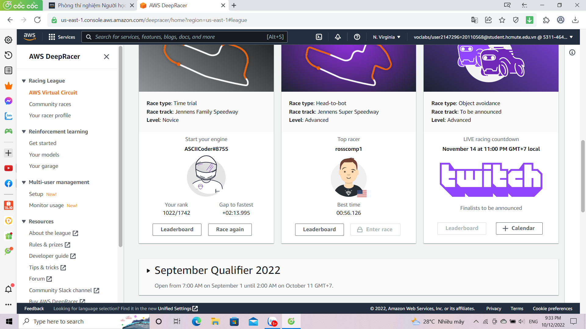

# THỰC NGHIỆM
## 3.1/ Một số thành tích nhóm  đạt được 

## 3.2/Kinh nghiệm nâng cao thứ hạng trong traing AWSDeepRacer 
- Thay đổi các giá trị của hàm  thưởng .
- Phân tích đường đua mục tiêu để có  thuật toán training phù hợp .
- Điều chỉnh tốc độ , góc lái ,  thời gian gian training sẽ đem giúp nâng cao  hiệu quả hàm .