# Chương 4 - Kĩ thuật tối ưu code phần thưởng
## 4.1/Input Parameters of the AWS DeepRacer Reward Function
 + "all_wheels_on_track" (Boolean)  : cờ để cho biết tác nhân có đang trên đường đi

 + "x" (float ) : tọa độ x của tác nhân tính bằng mét

 + "y"  (float)  : tọa độ y của tác nhân tính bằng mét

 + "closest_objects"  [ int , int ] : chỉ số dựa trên số 0 của hai đối tượng gần nhất với vị trí hiện tại của tác nhân là (x, y).

 + "closest_waypoints"  [ int , int ] : chỉ số của hai điểm tham chiếu gần nhất.

 + "is_crashed"  (Boolean) :  Boolean cờ để cho biết tác nhân có bị rơi hay không.

 + "is_left_of_center" (Boolean)   :  Gắn cờ để cho biết nhân viên hỗ trợ có ở bên trái trung tâm đường đua hay không.

 + "is_offtrack"  (Boolean)  : Boolean cờ để cho biết tác nhân có đi chệch hướng hay không.

 + "is_reversed" (Boolean)  : để cho biết tác nhân đang lái theo chiều kim đồng hồ (Đúng) hay ngược chiều kim đồng hồ (Sai).

 + "heading" (float) :  đặc vụ ngáp theo độ
 
 + "objects_ distance" ([ float , ]) :  danh sách khoảng cách của các đối tượng tính bằng mét giữa 0 và track_length liên quan đến vạch xuất phát.

 + "objects_heading" ([ float , ] ) : danh sách các tiêu đề của đối tượng theo độ từ -180 đến 180.

 + "objects_left_of_center" ([ Boolean , ]) : danh sách các cờ Boolean cho biết đối tượng của các phần tử có nằm bên trái tâm hay không (Đúng ) hay không (Sai).

 + "objects_location"  [( float , float ),] : danh sách vị trí đối tượng [(x,y),...].

 + "progress" (float )  : phần trăm đường đua đã hoàn thành

 + "speed"  (float) : tốc độ của tác nhân tính bằng mét trên giây (m/s)

 + "steering_angle" (float)  : góc lái của tác nhân tính theo độ

 + "steps" (int) : số bước đã hoàn thành

 + "track_length" (float)  : chiều dài theo dõi tính bằng mét.

 + "track_width" (float )  : chiều rộng của rãnh
 
## 4.2/ Hyperparameters

Siêu tham số là các biến để kiểm soát quá trình đào tạo học tăng cường của bạn. Chúng có thể được điều chỉnh để tối ưu hóa thời gian đào tạo và hiệu suất mô hình của bạn.

Kỹ thuật tối ưu hóa mà AWS Deepracer sử dụng là PPO viết tắt của Proximal Policy Optimization. 

Nhìn vào các tham số siêu khác nhau:

### 1.  Gradient descent batch size

Số lượng trải nghiệm phương tiện gần đây được lấy mẫu ngẫu nhiên từ bộ đệm trải nghiệm và được sử dụng để cập nhật các trọng số mạng thần kinh học sâu cơ bản. Lấy mẫu ngẫu nhiên giúp giảm các mối tương quan vốn có trong dữ liệu đầu vào. Sử dụng kích thước lô lớn hơn để thúc đẩy các bản cập nhật ổn định và mượt mà hơn cho các trọng số của mạng thần kinh, nhưng hãy lưu ý đến khả năng quá trình đào tạo có thể dài hơn hoặc chậm hơn.

Lô này là một tập hợp con của bộ đệm trải nghiệm bao gồm các hình ảnh do camera gắn trên phương tiện AWS DeepRacer ghi lại và các hành động mà phương tiện thực hiện.

### 2. Number of epochs

Số lần chuyển qua dữ liệu huấn luyện để cập nhật trọng số mạng thần kinh trong quá trình giảm dần độ dốc. Dữ liệu đào tạo tương ứng với các mẫu ngẫu nhiên từ bộ đệm trải nghiệm. Sử dụng số lượng kỷ nguyên lớn hơn để thúc đẩy các bản cập nhật ổn định hơn, nhưng mong đợi quá trình đào tạo chậm hơn. Khi kích thước lô nhỏ, bạn có thể sử dụng số lượng kỷ nguyên nhỏ hơn.

### 3. Learning rate

Trong mỗi lần cập nhật, một phần của trọng số mới có thể là từ đóng góp giảm độ dốc (hoặc tăng dần) và phần còn lại từ giá trị trọng số hiện có. Tốc độ học tập kiểm soát mức độ đóng góp của bản cập nhật giảm dần (hoặc tăng dần) vào trọng số mạng. Sử dụng tốc độ học tập cao hơn để bao gồm nhiều đóng góp giảm dần độ dốc để đào tạo nhanh hơn, nhưng hãy lưu ý khả năng phần thưởng mong đợi có thể không hội tụ nếu tốc độ học tập quá lớn.

### 4. Entropy

Mức độ không chắc chắn được sử dụng để xác định thời điểm thêm tính ngẫu nhiên vào phân phối chính sách. Tính không chắc chắn tăng thêm giúp phương tiện AWS DeepRacer khám phá không gian hành động rộng hơn. Giá trị entropy lớn hơn sẽ khuyến khích phương tiện khám phá không gian hành động kỹ lưỡng hơn.

### 5.  Discount factor

Hệ số chiết khấu xác định phần thưởng trong tương lai được chiết khấu bao nhiêu khi tính toán phần thưởng ở một trạng thái nhất định dưới dạng phần thưởng trung bình trên tất cả các trạng thái trong tương lai. Hệ số chiết khấu bằng 0 có nghĩa là trạng thái hiện tại không phụ thuộc vào các bước trong tương lai, trong khi hệ số chiết khấu 1 có nghĩa là bao gồm cả đóng góp từ tất cả các bước trong tương lai. Với hệ số chiết khấu là 0,9, phần thưởng dự kiến ​​ở một bước nhất định bao gồm phần thưởng từ đơn đặt hàng gồm 10 bước trong tương lai. Với hệ số chiết khấu là 0,999, phần thưởng dự kiến ​​bao gồm phần thưởng từ đơn đặt hàng 1000 bước trong tương lai.

### 6. Loss type

Loại hàm mục tiêu để cập nhật trọng số mạng. Một thuật toán đào tạo tốt sẽ thực hiện các thay đổi gia tăng đối với chiến lược của phương tiện để nó dần dần chuyển từ thực hiện các hành động ngẫu nhiên sang thực hiện các hành động chiến lược để tăng phần thưởng. Nhưng nếu nó tạo ra một thay đổi quá lớn thì quá trình đào tạo trở nên không ổn định và tác nhân sẽ không học được. Các loại tổn thất do lỗi bình phương Huber và Mean hoạt động tương tự đối với các bản cập nhật nhỏ. Nhưng khi các bản cập nhật trở nên lớn hơn, tổn thất Huber sẽ tăng nhỏ hơn so với tổn thất lỗi bình phương trung bình. Khi bạn gặp vấn đề về hội tụ, hãy sử dụng loại mất mát Huber. Khi hội tụ tốt và bạn muốn đào tạo nhanh hơn, hãy sử dụng loại tổn thất lỗi bình phương trung bình.

### 7. Number of experience episodes between each policy-updating iteration

Kích thước của bộ đệm trải nghiệm được sử dụng để lấy dữ liệu huấn luyện từ các trọng số mạng chính sách học tập. Đoạn đường là khoảng thời gian mà phương tiện xuất phát từ một điểm xuất phát nhất định và kết thúc là hoàn thành đường đua hoặc chệch khỏi đường đua. Các tập khác nhau có thể có độ dài khác nhau. Đối với các vấn đề học tăng cường đơn giản, một bộ đệm kinh nghiệm nhỏ có thể đủ và việc học sẽ nhanh chóng. Đối với các vấn đề phức tạp hơn có nhiều cực đại cục bộ hơn, bộ đệm kinh nghiệm lớn hơn là cần thiết để cung cấp nhiều điểm dữ liệu không tương quan hơn. Trong trường hợp này, đào tạo sẽ chậm hơn nhưng ổn định hơn. Các giá trị được khuyến nghị là 10, 20 và 40.

## 4.3/Waypoints Reward Function

## 4.4/Log Analysis 

Phân tích nhật ký là gì?

Phân tích nhật ký đang sử dụng sổ ghi chép Jupyter để phân tích và gỡ lỗi các mô hình dựa trên dữ liệu nhật ký được tạo từ môi trường đào tạo và mô phỏng AWS DeepRacer. Với các đoạn mã Python, bạn có thể vẽ biểu đồ và trực quan hóa hiệu suất đào tạo của mô hình thông qua các biểu đồ và bản đồ nhiệt khác nhau. Tôi đã tạo ra một số hình ảnh trực quan độc đáo mà cuối cùng đã giúp tôi huấn luyện một người mẫu đủ nhanh và ổn định để giành chiến thắng trong Cuộc đua F1 ProAm.

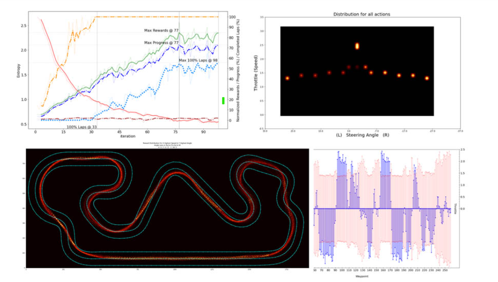

Hình 1 Trực quan hóa phân tích nhật ký

Trong bài đăng này, tôi chia sẻ một số hình ảnh trực quan hóa mà tôi đã tạo và chỉ ra cách bạn có thể sử dụng Amazon SageMaker để khởi tạo phiên bản sổ ghi chép nhằm thực hiện phân tích nhật ký bằng cách sử dụng dữ liệu đào tạo mô hình DeepRacer.

Nếu bạn đã quen với việc mở sổ ghi chép trong ứng dụng sổ ghi chép JupyterLab, thì bạn chỉ cần sao chép kho lưu trữ phân tích nhật ký của tôi và cuộn xuống phần phân tích nhật ký trong phần Tải xuống nhật ký từ bảng điều khiển AWS DeepRacer của bài đăng này.

Phiên bản sổ ghi chép Amazon SageMaker

Phiên bản sổ ghi chép Amazon SageMaker là phiên bản điện toán ML được quản lý chạy ứng dụng sổ ghi chép Jupyter. Amazon SageMaker quản lý việc tạo phiên bản và các tài nguyên liên quan của nó, vì vậy chúng tôi có thể tập trung vào việc phân tích dữ liệu thu thập được trong quá trình đào tạo mà không phải lo lắng về việc cung cấp trực tiếp Amazon Elastic Compute Cloud (Amazon EC2) hoặc tài nguyên lưu trữ.

Sử dụng phiên bản sổ ghi chép Amazon SageMaker để phân tích nhật ký

Một trong những lợi ích lớn nhất của việc sử dụng phiên bản sổ ghi chép Amazon SageMaker để thực hiện phân tích nhật ký AWS DeepRacer là Amazon SageMaker thay mặt chúng tôi tự động cài đặt các gói và thư viện Anaconda cho các nền tảng deep learning phổ biến, bao gồm cả các thư viện deep learning TensorFlow. Nó cũng tự động đính kèm một ổ lưu trữ ML vào phiên bản sổ ghi chép của chúng tôi, mà chúng tôi có thể sử dụng như một ổ lưu trữ hoạt động liên tục để thực hiện phân tích nhật ký và giữ lại các thành phần phân tích của chúng tôi.

Tạo một phiên bản sổ ghi chép

Để bắt đầu, hãy tạo một phiên bản sổ ghi chép trên bảng điều khiển Amazon SageMaker.

1. Trên bảng điều khiển Amazon SageMaker, trong Notebook , chọn Phiên bản Notebook .
2. Chọn Tạo phiên bản sổ ghi chép .

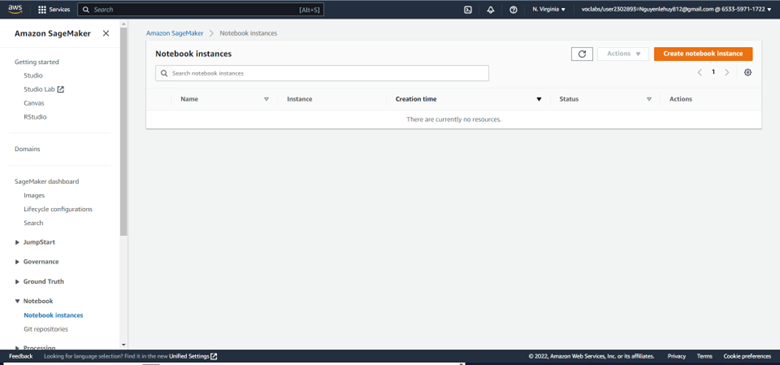

3. Đối với Tên phiên bản Notebook , hãy nhập tên (ví dụ: DeepRacer-Log-Analysis).
4. Đối với loại phiên bản Notebook ¸ chọn phiên bản của bạn.

Đối với phân tích nhật ký AWS DeepRacer, loại phiên bản nhỏ nhất (ml.t2.medium) thường là đủ.

5. Đối với Kích thước âm lượng tính bằng GB , hãy nhập kích thước dung lượng lưu trữ của bạn. Đối với bài đăng này, chúng tôi nhập 5.

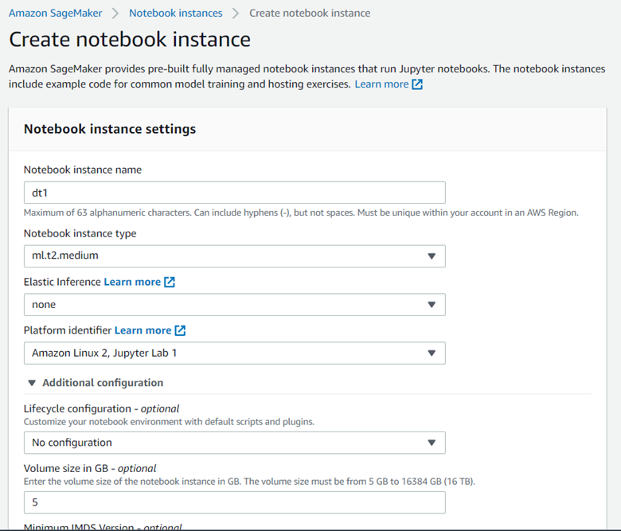

Khi phiên bản sổ ghi chép hiển thị trạng thái InService, chúng tôi có thể mở JupyterLab, IDE dành cho sổ ghi chép Jupyter.

6. Định vị phiên bản sổ ghi chép của bạn và chọn Mở JupyterLab .

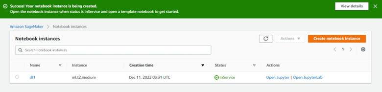

Nhân bản repo phân tích nhật ký từ JupyterLab

Từ IDE JupyterLab, chúng tôi có thể dễ dàng sao chép kho lưu trữ Git để sử dụng sổ ghi chép phân tích nhật ký do cộng đồng chia sẻ. Ví dụ: tôi có thể sao chép kho lưu trữ phân tích nhật ký của mình sau vài giây, sử dụng https://github.com/TheRayG/deepracer-log-analysis.git làm URI Nhân bản.

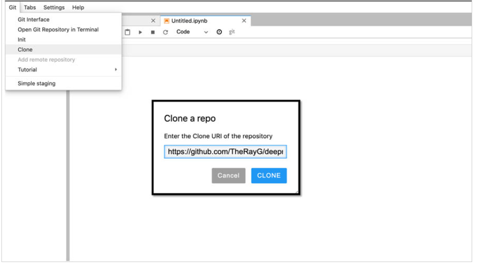

Sau khi sao chép kho lưu trữ, chúng ta sẽ thấy nó xuất hiện trong cấu trúc thư mục ở bên trái của IDE JupyterLab.

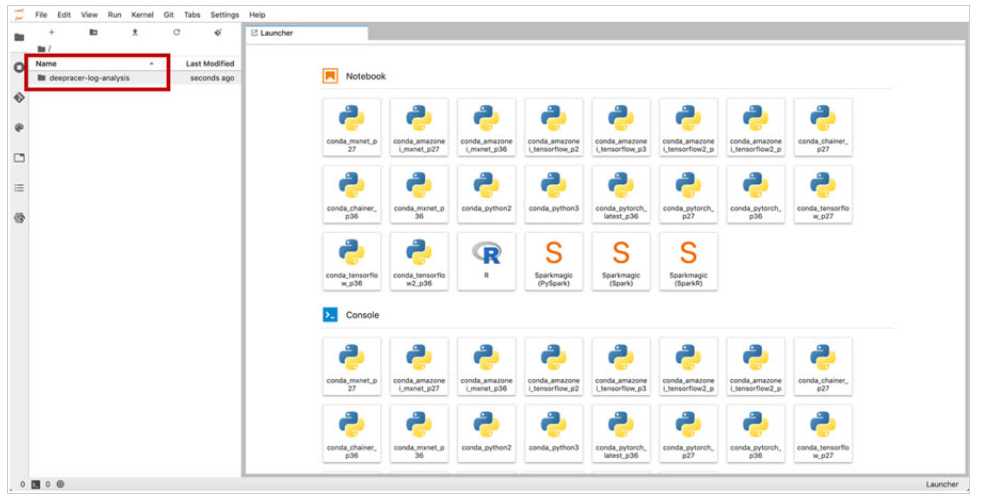

Tải nhật ký xuống từ bảng điều khiển AWS DeepRacer

Để chuẩn bị dữ liệu mà chúng tôi muốn phân tích, chúng tôi phải tải nhật ký đào tạo mô hình xuống từ bảng điều khiển AWS DeepRacer.

1. Trên bảng điều khiển AWS DeepRacer, trong Reinforcement learning , chọn Your models .
2. Chọn mô hình để phân tích.
3. Trong phần Đào tạo , bên dưới Tài nguyên , chọn Tải xuống Nhật ký .

Thao tác này sẽ tải xuống các tệp nhật ký đào tạo, được đóng gói trong tệp .tar.gz.

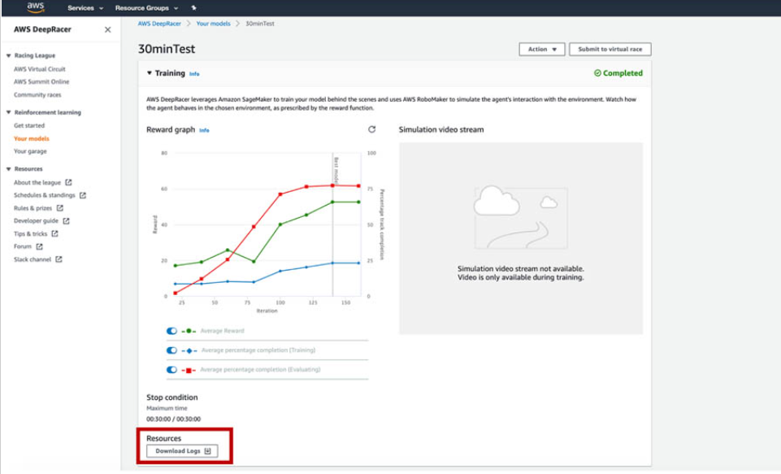

Trích xuất các tệp nhật ký cần thiết để phân tích

Trong bước này, chúng tôi hoàn thành các cấu hình cuối cùng.

1. Trích xuất các tệp nhật ký RoboMaker và Amazon SageMaker từ gói .tar.gz (có trong thư mục con logs/training/).

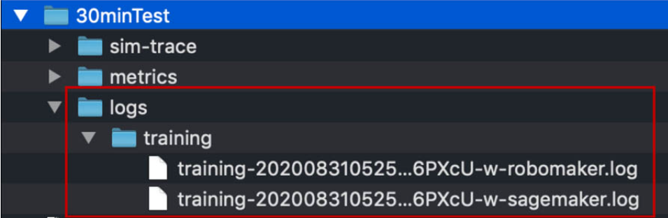

2. Tải hai tệp nhật ký lên thư mục /deepracer-log-analysis/logs trong IDE JupyterLab.

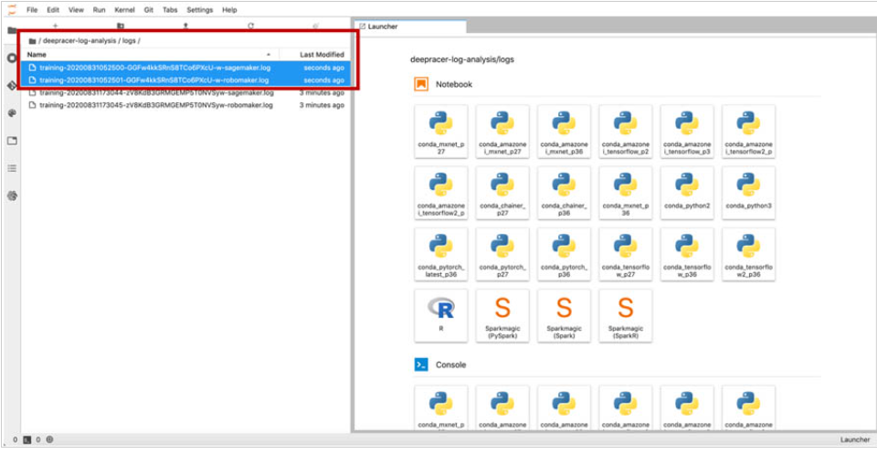

Bây giờ chúng tôi đã sẵn sàng mở sổ ghi chép phân tích nhật ký của mình để phát huy tác dụng kỳ diệu của nó!

3. Điều hướng đến thư mục /deepracer-log-analysis ở phía bên trái của IDE và chọn tệp .ipynb để mở sổ ghi chép.
4. Khi mở sổ ghi chép, bạn có thể được nhắc cung cấp kernel. Chọn một nhân sử dụng Python 3, chẳng hạn như conda_tensorflow_p36.

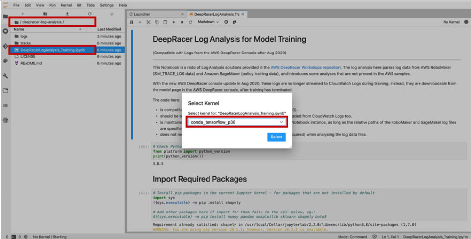

5. Đợi cho đến khi trạng thái hạt nhân thay đổi từ Bắt đầu sang Không hoạt động.
6. Chỉnh sửa sổ ghi chép để chỉ định đường dẫn và tên của hai tệp nhật ký mà chúng tôi vừa tải lên.

Để thực hiện trực quan hóa, chúng tôi sử dụng dữ liệu theo dõi mô phỏng từ tệp nhật ký RoboMaker và dữ liệu cập nhật chính sách từ tệp nhật ký Amazon SageMaker. Chúng tôi phân tích cú pháp dữ liệu trong sổ ghi chép bằng khung dữ liệu gấu trúc, là cấu trúc dữ liệu được gắn nhãn hai chiều như bảng tính hoặc bảng SQL.

Đối với tệp nhật ký RoboMaker, chúng tôi tổng hợp thông tin quan trọng, chẳng hạn như tiến độ tối thiểu, tối đa và trung bình cũng như tỷ lệ hoàn thành vòng cho mỗi lần lặp lại các giai đoạn đào tạo.

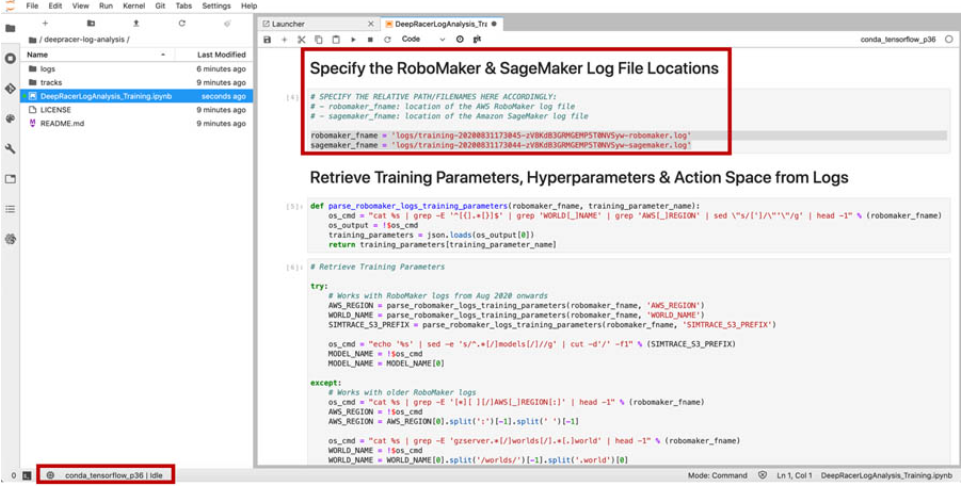

Đối với tệp nhật ký Amazon SageMaker, chúng tôi tính toán entropy trung bình trên mỗi kỷ nguyên trong mỗi lần lặp cập nhật chính sách.

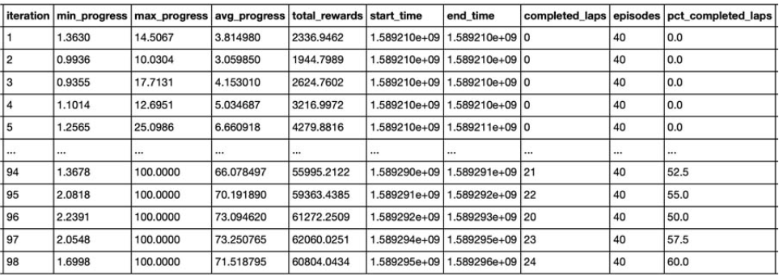

Thực hiện trực quan hóa

Bây giờ chúng ta có thể chạy sổ ghi chép bằng cách chọn Chạy và Chạy Tất cả các Ô trong JupyterLab. Sổ ghi chép phân tích nhật ký của tôi chứa nhiều mô tả và nhận xét đánh dấu để giải thích chức năng của từng ô. Trong phần này, tôi nhấn mạnh một số hình dung từ cuốn sổ đó và giải thích một số quá trình suy nghĩ đằng sau chúng.

Trực quan hóa phong bì hiệu suất của mô hình

Những người mới bắt đầu sử dụng AWS DeepRacer thường có một câu hỏi là: “Nếu hai mô hình được đào tạo trong cùng một khoảng thời gian bằng cách sử dụng cùng chức năng phần thưởng và siêu tham số, thì tại sao chúng lại có thời gian vòng chạy khác nhau khi tôi đánh giá chúng?”

Hình dung sau đây là một cách tuyệt vời để giải thích nó; nó hiển thị tần suất của hiệu suất đến thời gian vòng chạy tính bằng giây.

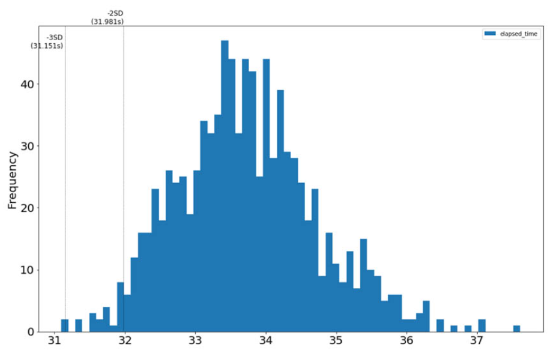

Tôi sử dụng điều này để minh họa phong bì hiệu suất của mô hình của tôi. Chúng ta có thể chỉ ra xác suất tương đối của việc mô hình đạt được các thời gian vòng chạy khác nhau bằng cách vẽ biểu đồ về thời gian vòng chạy mà mô hình đạt được trong quá trình đào tạo. Chúng tôi cũng có thể tính toán theo thống kê thời gian vòng chạy trung bình và trường hợp tốt nhất mà chúng tôi có thể mong đợi từ mô hình. Tôi nhận thấy rằng thời gian vòng chạy của mô hình trong quá trình đào tạo giống với phân phối bình thường, vì vậy tôi sử dụng các điểm đánh dấu -2 và -3 Std Dev để hiển thị thời gian vòng chạy trong trường hợp tốt nhất tiềm năng cho mô hình, mặc dù chỉ với 2,275% (- 2 SD) và 0,135% (-3 SD) cơ hội xảy ra tương ứng. Bằng cách hiểu khả năng mô hình đạt được thời gian vòng chạy nhất định và so sánh thời gian đó với thời gian trên bảng xếp hạng, tôi có thể đánh giá xem mình có nên tiếp tục nhân bản và điều chỉnh mô hình hay từ bỏ mô hình đó và bắt đầu làm mới bằng một cách tiếp cận khác.

Xác định các điểm kiểm tra mô hình tiềm năng để gửi cuộc đua

Khi huấn luyện nhiều người mẫu khác nhau cho một cuộc đua, các tay đua thường hỏi: "Mô hình nào sẽ cho tôi cơ hội chiến thắng cuộc đua ảo cao nhất?"

Để trả lời câu hỏi đó, tôi vẽ sơ đồ thời gian vòng đua thuộc nhóm tứ phân vị cao nhất (p25) so với số lần lặp lại từ dữ liệu huấn luyện, dữ liệu này xác định các mô hình tiềm năng để gửi cuộc đua. Biểu đồ phân tán này cũng cho phép tôi xác định khả năng đánh đổi giữa tốc độ (các chấm có thời gian vòng chạy rất nhanh) và độ ổn định (cụm các chấm dày đặc cho một lần lặp cụ thể). Từ sơ đồ sau, tôi sẽ chọn các mô hình từ ba lần lặp lại được đánh dấu để gửi cuộc đua.

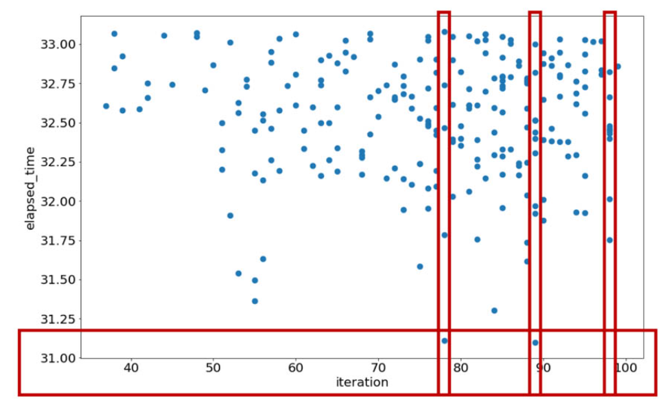

Xác định sự hội tụ và đánh giá tính nhất quán

Khi các tay đua có kinh nghiệm đào tạo người mẫu, họ bắt đầu chú ý đến sự hội tụ trong các mô hình của mình. Nói một cách đơn giản, sự hội tụ trong bối cảnh AWS DeepRacer là khi một mô hình đang hoạt động gần với mức tốt nhất của nó (xét về tiến độ vòng đua trung bình) và việc đào tạo thêm có thể gây hại cho hiệu suất của mô hình hoặc khiến mô hình trở nên quá khớp , khiến mô hình chỉ hoạt động tốt cho đường đua đó trong một môi trường mô phỏng rất cụ thể, nhưng không phải trong các đường đua khác hoặc trong ô tô AWS DeepRacer vật lý. Điều đó đặt ra những câu hỏi sau: “Làm cách nào để biết khi nào mô hình đã hội tụ?” và “Mô hình của tôi nhất quán như thế nào sau khi nó đã hội tụ?”

Để hỗ trợ hình dung sự hội tụ, tôi phủ thông tin entropy từ nhật ký đào tạo chính sách Amazon SageMaker lên các biểu đồ thông thường để nhận phần thưởng và tiến trình.

Entropy là thước đo mức độ ngẫu nhiên trong mạng lưới thần kinh học tập tăng cường của chúng tôi. Khi bắt đầu đào tạo mô hình, entropy cao vì mạng thần kinh của chúng tôi được cập nhật chủ yếu dựa trên các hành động ngẫu nhiên khi ô tô khám phá đường đua.

Theo thời gian, với nhiều kinh nghiệm thu được từ các hành động và phần thưởng ở các phần khác nhau của đường đua, chiếc xe bắt đầu khai thác thông tin này và thực hiện ít hành động ngẫu nhiên hơn.

Suy nghĩ đằng sau điều này là khi phần thưởng và tiến độ tăng lên, giá trị entropy sẽ giảm xuống. Khi phần thưởng và tiến độ ổn định, sự mất mát entropy cũng sẽ giảm dần. Do đó, tôi sử dụng entropy như một chỉ số bổ sung cho sự hội tụ.

Để đánh giá tính nhất quán của mô hình của mình, tôi cũng vẽ biểu đồ tỷ lệ hoàn thành vòng chạy trên mỗi lần lặp lại trong quá trình đào tạo. Khi mô hình có khả năng hoàn thành các vòng, tỷ lệ phần trăm của các vòng đã hoàn thành sẽ tăng lên trong các lần lặp lại tiếp theo, cho đến khi xung quanh điểm hội tụ, khi đó giá trị phần trăm cũng sẽ ổn định. Xem cốt truyện sau đây.

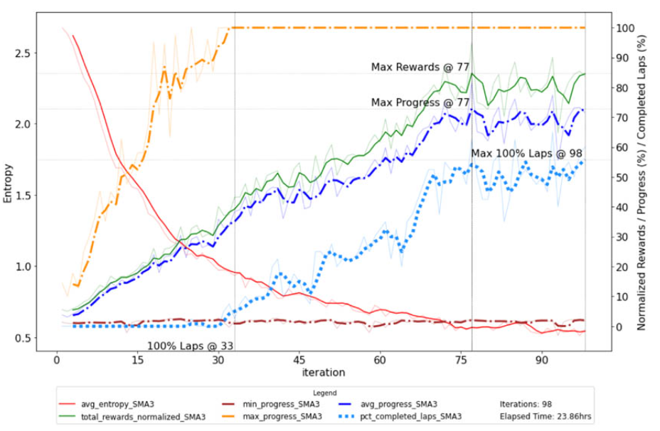

Quá trình đào tạo mô hình là xác suất vì tác nhân học tăng cường kết hợp entropy để khám phá môi trường. Để làm mịn các tác động của mô hình xác suất trong trực quan hóa của mình, tôi sử dụng một đường trung bình động đơn giản qua ba lần lặp lại cho mỗi chỉ số được vẽ trên biểu đồ của mình.

Xác định sự thiếu hiệu quả trong hành vi lái xe

Khi các tay đua có một mẫu xe cạnh tranh, họ có thể bắt đầu tự hỏi: “Có đoạn nào trên đường đua mà xe lái không hiệu quả không? Đâu là những đoạn đường mà tôi có thể khuyến khích xe tăng tốc?”

Để trả lời những câu hỏi này, tôi đã thiết kế một hình ảnh trực quan cho thấy tốc độ trung bình và góc lái của ô tô được đo tại mọi điểm tham chiếu dọc theo đường đua. Điều này cho phép tôi xem mô hình đang điều chỉnh đường đi như thế nào, bởi vì từ biểu đồ này, bạn có thể thấy tốc độ mà mô hình đang tăng tốc hoặc giảm tốc độ khi nó di chuyển qua các điểm tham chiếu. Hình ảnh trực quan sau đây cho thấy độ lệch của đường đua tối ưu (màu cam) so với đường tâm đường đua (màu xanh lam).

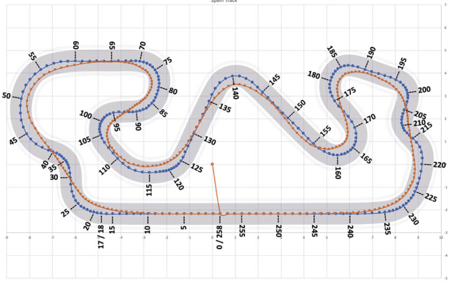

Bạn cũng có thể xem cách mô hình điều chỉnh góc lái khi thương lượng các khúc cua. Điều tôi thích ở hình ảnh trực quan sau đây là nó cho phép tôi thấy rõ điểm nào sau một đoạn đường thẳng dài mà mô hình bắt đầu phanh trước khi vào cua. Nó cũng giúp tôi hình dung liệu một mô hình có tăng tốc đủ nhanh khi thoát khỏi một khúc cua hay không.

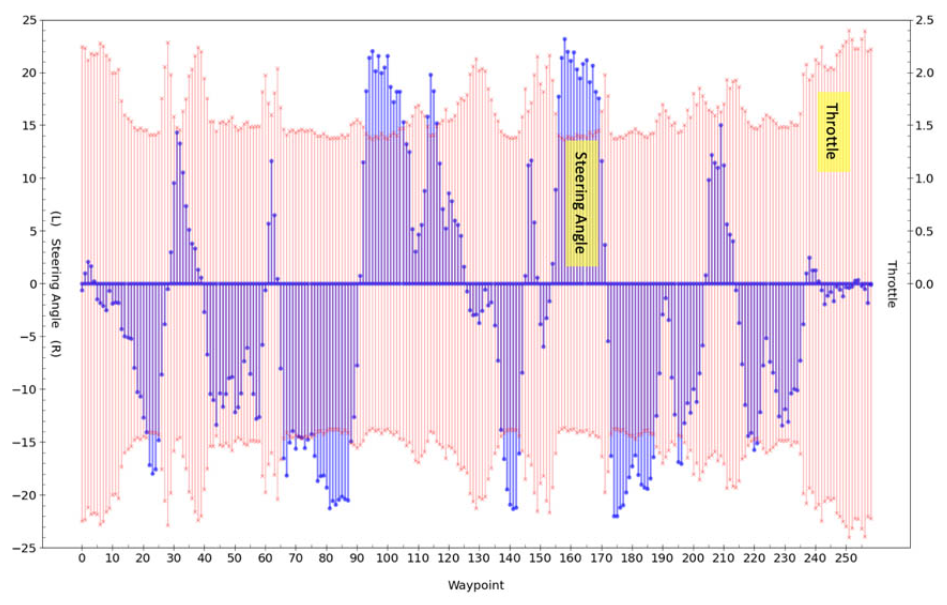

Xác định các phần theo dõi để điều chỉnh hành động và phần thưởng

Mặc dù tốc độ là tiêu chí hiệu suất chính trong cuộc đua thử thời gian, nhưng sự ổn định cũng rất quan trọng trong cuộc đua tránh đối tượng hoặc đối đầu. Bởi vì các hình phạt về thời gian do đi sai đường đua ảnh hưởng đến vị trí cuộc đua, điều rất quan trọng là phải tìm được sự cân bằng phù hợp giữa tốc độ và sự ổn định. Ngay cả khi mẫu xe có thể vượt qua đường đua tốt, các tay đua hàng đầu cũng đặt câu hỏi: “Chiếc xe có đang lái quá mức hoặc thiếu lái ở bất kỳ khúc cua nào không? Tôi nên tập trung tối ưu hóa vào lượt nào trong các thử nghiệm tiếp theo?”

Bằng cách vẽ biểu đồ nhiệt phần thưởng trên đường đua, bạn có thể dễ dàng thấy mức độ nhất quán mà chúng tôi khen thưởng cho mô hình ở các phần khác nhau của đường đua. Một dải mỏng trong bản đồ nhiệt phản ánh phần thưởng rất nhất quán, trong khi các chấm rải rác thưa thớt thu hút sự chú ý đến các phần của đường đua mà người mẫu gặp khó khăn khi nhận phần thưởng. Đối với chức năng phần thưởng của tôi, điều này thường làm nổi bật các khúc cua mà tại đó mô hình lái quá hoặc lái thiếu.

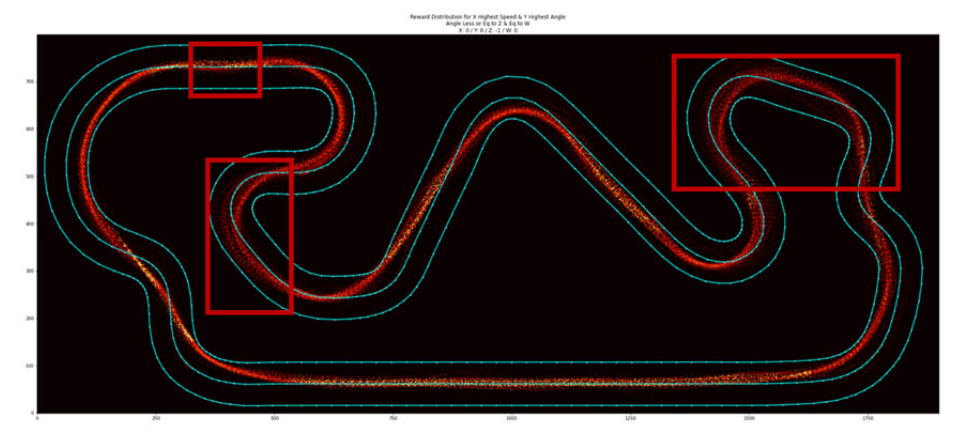

Ví dụ: trong các phần được đánh dấu của cốt truyện trước đó, mô hình không nhất quán đi quanh các khúc cua đó theo đường đua mà tôi đang thưởng. Nó thực sự đang lái quá tay khi thoát khỏi Lượt 3 (quanh điểm tham chiếu 62 – tham khảo hình ảnh trong phần Xác định hành vi lái xe không hiệu quả ) và bẻ lái thiếu ở hai ngã rẽ được đánh dấu khác. Tinh chỉnh không gian hành động có thể hữu ích (trong trường hợp đánh lái thiếu, giảm tốc độ ở góc đánh lái cao). Thật thú vị, tỷ lệ hoàn thành vòng đua của mô hình có thể tăng đáng kể với những điều chỉnh nhỏ như vậy mà không ảnh hưởng đến thời gian vòng đua!

Thí nghiệm, thí nghiệm, thí nghiệm

Đối với Giải đua F1 ProAm diễn ra vào tháng 5 năm 2020, tôi đã lên kế hoạch thực hiện hai thử nghiệm mỗi ngày (tổng cộng ít nhất 60 thử nghiệm) để thử các chiến lược phần thưởng và đường đua khác nhau. Tôi có thể lặp lại nhanh chóng trong khi tập trung vào các cải tiến gia tăng bằng cách sử dụng phân tích nhật ký để hiển thị thông tin chi tiết từ dữ liệu đào tạo.

Ví dụ: cốt truyện sau đây đã giúp tôi trả lời câu hỏi “Có phải chiếc xe sẽ chạy hết vòng nhanh nhất có thể không?” bằng cách hiển thị nơi xe sử dụng 0 độ và tốc độ cao nhất.

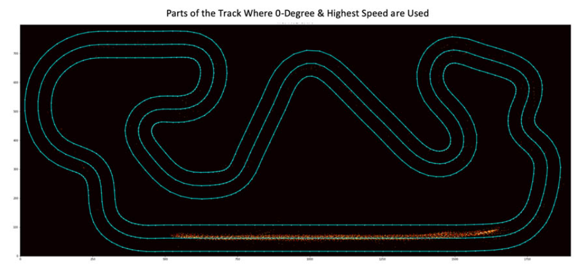

Dọn dẹp

Để tiết kiệm chi phí điện toán ML, khi bạn hoàn thành phân tích nhật ký, bạn có thể dừng phiên bản sổ ghi chép mà không xóa nó. Các tệp sổ ghi chép, dữ liệu và nhật ký vẫn được giữ lại miễn là bạn không xóa phiên bản sổ ghi chép. Một phiên bản đã dừng vẫn phát sinh chi phí cho bộ lưu trữ ML được cung cấp. Tuy nhiên, bạn luôn có thể khởi động lại phiên bản sau để tiếp tục làm việc trên sổ ghi chép.

Khi không cần sổ ghi chép hoặc dữ liệu nữa, bạn có thể xóa vĩnh viễn phiên bản, thao tác này cũng xóa ổ lưu trữ ML được đính kèm để bạn không còn phải chịu chi phí lưu trữ ML liên quan của phiên bản đó nữa.

Để biết chi tiết về giá cho các phiên bản máy tính xách tay Amazon SageMaker, hãy xem Giá của Amazon SageMaker .

## 4.5/ Một số code  phần thưởng tối ưu :
### Example 1: Đi theo đường trung tâm trong thử nghiệm thời gian
    def reward_function(params):
    '''
   Ví dụ về thưởng đi theo đường trung tâm
    '''

    //Đọc thông số đầu vào
    track_width = params['track_width']
    distance_from_center = params['distance_from_center']
    //Tính 3 điểm đánh dấu ngày càng xa đường trung tâm
    marker_1 = 0.1 * track_width
    marker_2 = 0.25 * track_width
    marker_3 = 0.5 * track_width
    //Thưởng cao hơn nếu xe càng gần đường trung tâm và ngược lại
    if distance_from_center <= marker_1:
    reward = 1
    elif distance_from_center <= marker_2:
    reward = 0.5
    elif distance_from_center <= marker_3:
    reward = 0.1
    else:
    reward = 1e-3 # likely crashed/ close to off track
    return reward
### Example 2: Ở bên trong hai biên giới trong thử nghiệm thời gian
    def reward_function(params):
    '''
    Ví dụ về phần thưởng cho đại lý ở bên trong hai đường viền của đường đua
    '''

    // Đọc tham số đầu vào
    all_wheels_on_track = params['all_wheels_on_track']
    distance_from_center = params['distance_from_center']
    track_width = params['track_width']

    // Đưa ra phần thưởng rất thấp theo mặc định
    reward = 1e-3
    // Trao phần thưởng cao nếu không có bánh nào chệch khỏi đường ray và
    // chiếc xe ở đâu đó giữa các đường viền
    if all_wheels_on_track and (0.5*track_width - distance_from_center) >= 0.05:
    reward = 1.0
    // Always return a float value
    return reward
### Example 3: Prevent Zig-Zag in Time Trials
    def reward_function(params):
    '''
    Ví dụ về chỉ đạo phạt, giúp giảm thiểu các hành vi sai
    '''

    // Đọc tham số đầu vào
    distance_from_center = params['distance_from_center']
    track_width = params['track_width']
    steering = abs(params['steering_angle']) # Chỉ cần góc lái tuyệt đối
    // Tính 3 điểm xa hơn và cha xa trung tâm hơn
    marker_1 = 0.1 * track_width
    marker_2 = 0.25 * track_width
    marker_3 = 0.5 * track_width
    // Phần thưởng cao hơn nếu xe càng gần đường trung tâm và ngược lại
    if distance_from_center <= marker_1:
    reward = 1.0
    elif distance_from_center <= marker_2:
    reward = 0.5
    elif distance_from_center <= marker_3:
    reward = 0.1
    else:
    reward = 1e-3 # likely crashed/ close to off track
    // Ngưỡng phạt lái, thay đổi số dựa trên cài đặt không gian hành động của bạn
    ABS_STEERING_THRESHOLD = 15
    // Thưởng phạt nếu xe bẻ lái quá nhiều
    if steering > ABS_STEERING_THRESHOLD:
    reward *= 0.8
    return float(reward)
### Example 4: Đi trên một làn đường mà không đâm vào chướng ngại vật cố định hoặc phương tiện đang di chuyển
    def reward_function(params):
    '''
    Ví dụ về thưởng cho đại lý ở bên trong hai biên giới
    và xử phạt khi đến quá gần các đối tượng phía trước
    '''
    all_wheels_on_track = params['all_wheels_on_track']
    distance_from_center = params['distance_from_center']
    track_width = params['track_width']
    objects_distance = params['objects_distance']
    _, next_object_index = params['closest_objects']
    objects_left_of_center = params['objects_left_of_center']
    is_left_of_center = params['is_left_of_center']
    // Khởi tạo phần thưởng với một số nhỏ nhưng không phải bằng không
    //vì số không có nghĩa là lạc đường hoặc bị hỏng
    reward = 1e-3
    // Phần thưởng nếu đại lý ở bên trong hai đường viền của đường đua
    if all_wheels_on_track and (0.5 * track_width - distance_from_center) >= 0.05:
    reward_lane = 1.0
    else:
    reward_lane = 1e-3
    
    // Phạt nếu tác tử ở quá gần đối tượng tiếp theo
    reward_avoid = 1.0
    // Khoảng cách đến đối tượng tiếp theo
    distance_closest_object = objects_distance[next_object_index]
    // Quyết định xem tác nhân và đối tượng tiếp theo có trên cùng một làn không
    is_same_lane = objects_left_of_center[next_object_index] == is_left_of_center

    if is_same_lane:
    if 0.5 <= distance_closest_object < 0.8:
    reward_avoid *= 0.5
    elif 0.3 <= distance_closest_object < 0.5:
    reward_avoid *= 0.2
    elif distance_closest_object < 0.3:
    reward_avoid = 1e-3 # Likely crashed
    / Tính toán phần thưởng bằng cách đặt các trọng số khác nhau
    // hai khía cạnh trên
    reward += 1.0 * reward_lane + 4.0 * reward_avoid
    return reward
## 4.6/Một số model trainng có hiệu suất tốt
### EX1:
 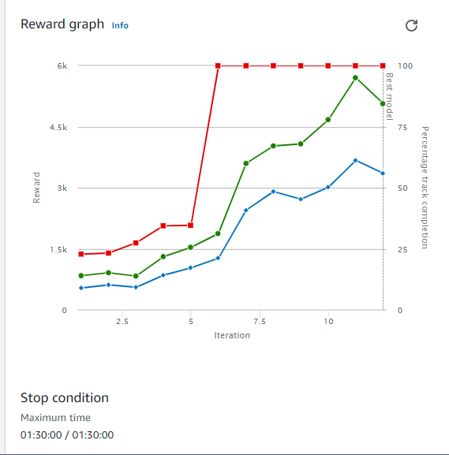
    def reward_function(params):

    """
     Xác định chức năng khen thưởng dựa trên kế hoạch
     Chức năng này chỉ định ba cách để kiểm tra xem chúng ta nên thưởng hay phạt tác nhân đó. Đầu tiên, nó sẽ kiểm tra xem tất cả các bánh xe có đi đúng hướng hay không. Đại lý sẽ nhận được nhiều phần thưởng hơn bằng cách ở trong đường đua. Bất cứ khi nào bất kỳ bánh xe nào bị chệch hướng,  sẽ bị phạt 10 điểm. 

    Thứ hai, nó sẽ kiểm tra vị trí của tác nhân dựa trên các điểm tham chiếu. Vì đường dẫn mong muốn được chỉ định, đặt các thuộc tính của hàm phần thưởng. Đầu tiên,  chia các điểm tham chiếu thành ba mảng, trái, phải và trung tâm, dựa trên đường dẫn mong muốn. Sau khi đặt tất cả các điểm vào ba mảng này, chúng tôi xác định phần thưởng như sau:
    """
    center_variance = params["distance_from_center"] / params["track_width"]

    #racing line

    left_lane = [23,24,50,51,52,53,61,62,63,64,65,66,67,68]#Fill in the waypoints

   

    center_lane = [0,1,2,3,4,5,6,7,8,9,10,11,12,13,14,15,16,17,18,19,20,21,22,25,26,27,28,35,36,37,38,39,40,41,42,43,44,45,46,47,48,49,54,55,56,57,58,59,60,69,70]#Fill in the waypoints

   

    right_lane = [29,30,31,32,33,34]#Fill in the waypoints

   

    #Speed :  kiểm tra tốc độ của tác nhân dựa trên các điểm tham chiếu

    fast = [0,1,2,3,4,5,6,7,8,9,25,26,27,28,29,30,31,32,51,52,53,54,61,62,63,64,65,66,67,68,69,70] #3

    moderate = [33,34,35,36,37,38,39,40,41,42,43,44,45,46,47,48,49,50,55,56,57,58,59,60] #2

    slow = [10,11,12,13,14,15,16,17,18,19,20,21,22,23,24] #1

 

    reward = 30

 

    if params["all_wheels_on_track"]:

        reward += 10

    else:

        reward -= 10

 

    if params["closest_waypoints"][1] in left_lane and params["is_left_of_center"]:

        reward += 10

    elif params["closest_waypoints"][1] in right_lane and not params["is_left_of_center"]:

        reward += 10

    elif params["closest_waypoints"][1] in center_lane and center_variance < 0.4:

        reward += 10

    else:

        reward -= 10

       

    if params["closest_waypoints"][1] in fast:

        if params["speed"] > 1.5 :

            reward += 10

        else:

            reward -= 10

    elif params["closest_waypoints"][1] in moderate:

        if params["speed"] > 1 and params["speed"] <= 1.5 :

            reward += 10

        else:

            reward -= 10

    elif params["closest_waypoints"][1] in slow:

        if params["speed"] <= 1 :

            reward += 10

        else:

            reward -= 10

       

   

    return float(reward)

### EX2: 
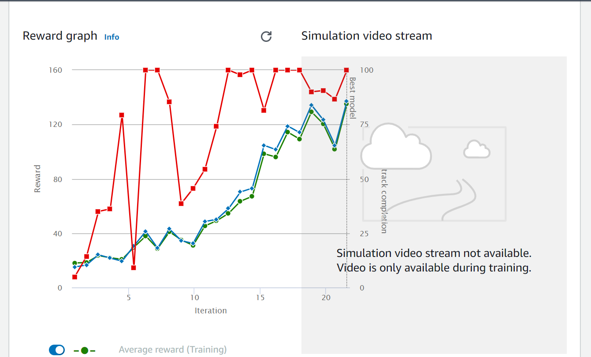
     import math

    

    def reward_function(params):  

        # Read input variables

        waypoints = params['waypoints']

        closest_waypoints = params['closest_waypoints']

        heading = params['heading']

    

        # Initialize the reward with typical value

        reward = 1.0

        # Calculate the direction of the center line based 

        next_point = waypoints[closest_waypoints[1]]

        prev_point = waypoints[closest_waypoints[0]]

        # Calculate the direction in radius, arctan2(dy, dx), 

        track_direction = math.atan2(next_point[1] - prev_point[1], next_point[0] - prev_point[0])

        # Convert to degree

        track_direction = math.degrees(track_direction)

        # Calculate the difference between the track direction and the heading direction of the car

        direction_diff = abs(track_direction - heading)

        if direction_diff > 180:

            direction_diff = 360 - direction_diff

        # Penalize the reward if the difference is too large

        DIRECTION_THRESHOLD = 10.0

        if direction_diff > DIRECTION_THRESHOLD:

            reward *= 0.5

        return float(reward)
